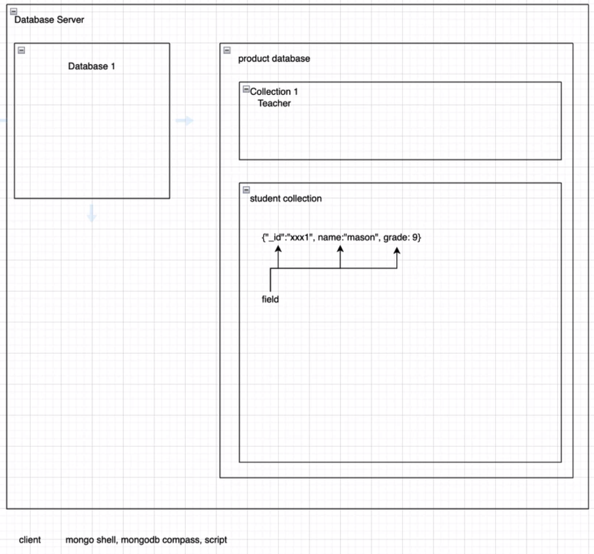

# NodeJS - Database

## 主要知识点

### SQL & NoSQL
### MongoDB

# 课堂笔记

### 数据库

- Data Persistence
  非关系型数据库(NoSQL)：MongoDB，LevelDB……
  关系型数据库(SQL)：Sqlite，MySQL，PostgreSQL，SQL Server……
- document-oriented-> mongodb, dynamodb, firebase
- key-value -> redis
- graph-oriented -> neo4j
- column-family -> cassandra

### MongoDB Introduction

- 名字来源于: humongous 庞大的 -> Mongo
- Key value pairs - mongodb 里存数据, 是以文档的形式存储(简单来说就是一个'JsonLike'的 document - Binary Json(BSON))
- Collection
  [{
  _id:ObjectId('xx2),
  name:'yyy'
  },
  {
  _id:ObjectId('xx3),
  username:'yyy' - mongodb 完全接受这样不同的形式的数据, 只要 id 不要重复
  }]

### MongoDB Terminology

- Database Server - 需要先启动
- Database
- Product databse
- Collection
- Fileds
- Client : mongoShell / MongoDB Compass
  

### Document and data types

- \_id:int32(object)
- String
- Object
- Array - can be Array of document(string,object...)
- Boolean
- Number(int32,int64,float)
- Date(ISODate, timestamp)
  Check all in Mongodb Manual

### 安装数据库

- MongoDB : https://docs.mongodb.com/manual/administration/install-community/
- MongoShell: terminal 里打 mongo 启动(记得先启动 db server)

### MongoShell 语法

- show dbs : 显示我有多少个 db (默认有 admin, config,local 三个 db)
- use <name> : use School (创建并且切换到 School db)
- db 对象 : 当前的 db (school)
- db.students ( student collection )
- db.students.insertOne() (添加一个新 document 到当前 db(school)里的 student collection)
  db.students.insertOne({"name":"JR"})
  {
  "acknowledged" : true,
  "insertedId" : ObjectId("61fe394c291d02c731e420e4")
  }
- db.students.find() - collections 里的文档
- db.students.findOne({name:"JR"}) - 条件查询
- db.stduents.updateOne({1},{2}) - 更新单个数据,参数{1}:查询条件, 参数{2}:更新成什么样子
- CRUD operator $
  Update Operator 更新数据 : 
    $set -> db.stduents.updateOne({"name":"JR"},{$set:{"name":"JiangRen"}})
  db.students.updateOne({"name":"JiangRen"},{"hobbies":"Learning"}) 塞新的数据进去也是可以的
  db.students.updateMany({"name":"JiangRen"}, {$set:{"address":{"city":"Melbourne", "postcode":3000}})
  
  Query Operator 查询数据 : 
    $exist -> db.students.updateMany({"name": {$exist:false}}, {$set:{"name":"JiangJiang"}})
  
  Projection Operator : Used to limits only the first matching element from an array field

  Check more in MongoDB Documents: https://docs.mongodb.com/mongodb-shell/crud/#std-label-mdb-shell-crud

- 小 tips:
  tab(自动补全)
  括号没关上 db 会回(...)
  空 document 也会帮你创建一个文档和 unique id
  唯一性:类型和内容加在一起是唯一的 -> \_id:"123" 和\_id:ObjectId("123")是可以同时存在的, 因为类型不同

### 数据关联
- 一对一 一对多 多对多
- MongoDB: 
  Reference 关联式 -> 引用, 存id
    1对1 : 存一个id, 1对多: 存一个array of id, 多对多:互相存放彼此的id
  Embedded 嵌入式
    1对1 : 嵌入单个数据, 1对多:存一个array of object, 互相嵌套彼此的数据
- Embedded 多对多
  Student Collection - 这种结构的问题在于当你改单个数据的value,必须去全局collection里去找,然后更新所有的符合搜索条件内容
  [
    {
      _id:"s1",
      name:"JR",
      address:[
        {
          _id:"a1",
          city:"brisbane",
          postcode:2000
        },
        {
          _id:"a2",
          city:"sydney",
          postcode:2000
        },
      ]
    },
    {
      _id:"s2",
      name:"RJ",
      address:[
        {
          _id:"a1",
          city:"brisbane",
          postcode:2000
        },
        {
          _id:"a2",
          city:"sydney",
          postcode:2000
        },
      ]
    },
  ]
- Normalization(单次出现) and Denormalization(数据有复制)
  做denormalization一般是为了只拿到自己要的信息, 减少关联操作 (populate)
  读请求更多就可以做denormalization

### Indexes, Aggregation and Transaction
  - Indexes - 添加索引 可以帮助提升请求速度, 但不要所有地方都添加索引(占用资源)
  - Aggregation - 和后端的middleware概念很像, 对数据进行一系列的处理
    只有stage 1 会接触到原始数据, 处理后传给后面的state
    可以做数据添加/匹配
    数据的处理其实也可以走在后端的server, 但是不推荐,因为耗费资源和传输时间
    最好放在数据库里面, 这就是可以用到这个aggregation pipeline
  - transactions 概念: 
      举例: 银行转账中断 - 添加钱和减少钱需要同时发生
      两个操作合并到一个transaction里,要么同时成功,要么同时失败

                