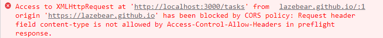
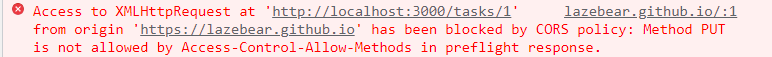

## CORS PROBLEM SOLUTION


```js
const cors = (req,res,next) => {
  res.setHeader('Access-Control-Allow-Origin','*');
  next();
}

app.use(cors);
```

```js
const cors = (req,res,next) => {
  res.setHeader('Access-Control-Allow-Origin','*');
  res.setHeader('Access-Control-Allow-Headers','content-type');
  next();
}
app.use(cors);
```


```js
const cors = (req,res,next) => {
  res.setHeader('Access-Control-Allow-Origin','*');
  res.setHeader('Access-Control-Allow-Headers','content-type');
  res.setHeader('Access-Control-Allow-Methods','*');
  next();
}
app.use(cors);
```
- 总结
```js
// Add headers
app.use(function (req, res, next) {

    // Website you wish to allow to connect
    res.setHeader('Access-Control-Allow-Origin', 'http://localhost:8888');

    // Request methods you wish to allow
    res.setHeader('Access-Control-Allow-Methods', 'GET, POST, OPTIONS, PUT, PATCH, DELETE');

    // Request headers you wish to allow
    res.setHeader('Access-Control-Allow-Headers', 'X-Requested-With,content-type');

    // Set to true if you need the website to include cookies in the requests sent
    // to the API (e.g. in case you use sessions)
    res.setHeader('Access-Control-Allow-Credentials', true);

    // Pass to next layer of middleware
    next();
});
```
  
