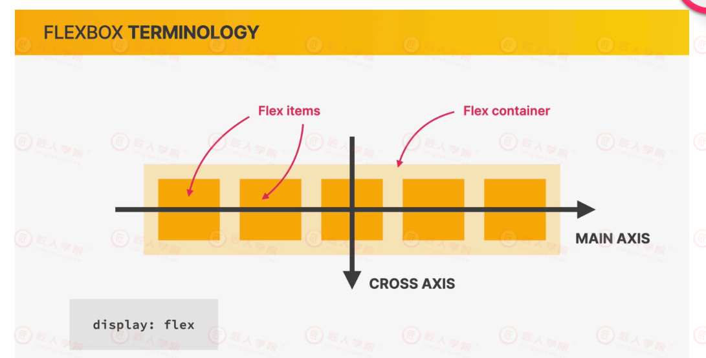
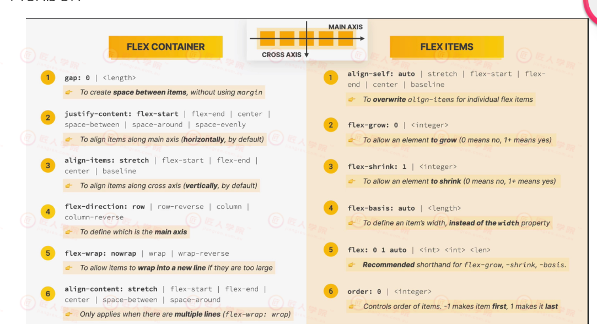
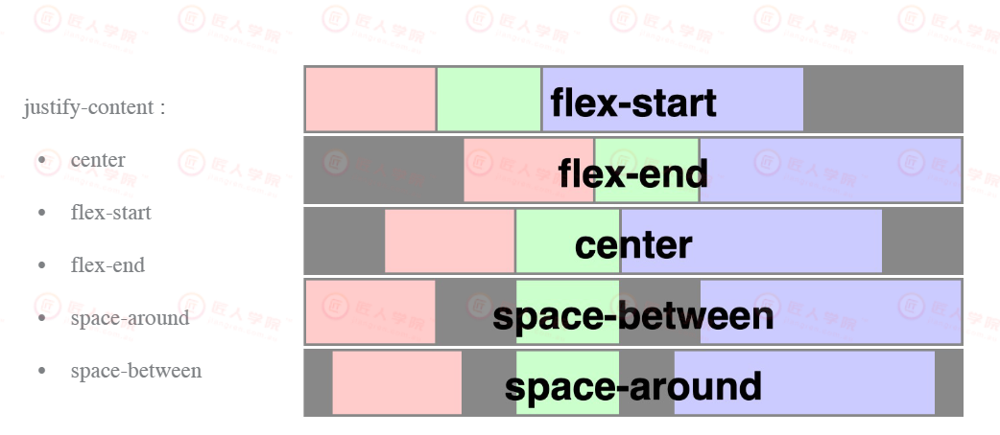
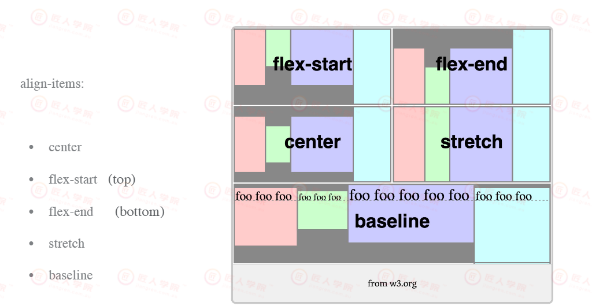
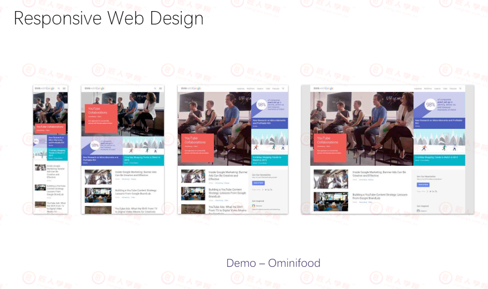
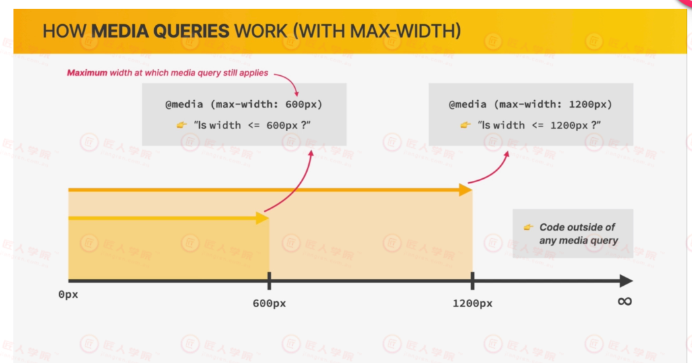
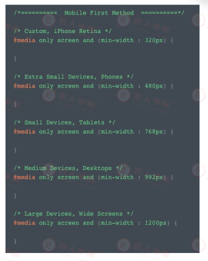

# Lecture 04 HTML & CSS

## 主要知识点
  - [Lecture 04  HTML&CSS](#lecture-04-htmlcss)
    - [4.1 Flexbox](#41-flexbox)
    	- [4.1.1 flex container/flex items](#411-flex-containerflex-items)
    - [4.2 Responsive Web Design](#42-responsive-web-design)
    	- [4.2.1 Media query](#421-media-query)
    - [4.3 SASS/SCSS](#43-sassscss)
    	- [4.3.1 Use&Install SASS](#431-useinstall-sass)
    	- [4.3.2 Nesting](#432-nesting)
    	- [4.3.3 Varibles](#433-varibles)
    	- [4.3.4 Maps/Lists](#434-mapslists)
    	- [4.3.5 Built-in Functions](#435-built-in-functions)
    	- [4.3.6 Better Import](#436-better-import)
    	- [4.3.7 Improve Media Query](#437-improve-media-query)
    	- [4.3.8 Inheritance](#438-inheritance)
    	- [4.3.9 Mixin](#439-mixin)
    - [4.4 Bootstrap](#44-bootstrap)
    - [4.5 个人网站参考](#45-个人网站参考)

# 课堂笔记

### Lecture 04 HTML&CSS
#### 4.1 Flexbox
- 一组 CSS properties，用来写纵向或横向的layout
- main idea：可以用flexbox 方便地分配child elements的spacing
- align items to one another
- vertical centering / create equal height columns
- 用来代替 float


#### 4.1.1 flex container/flex items

flex container
没有定义flex时，每一个新的元素都会占据parent element的一个new line
- gap: 不算上margin的 item间的space，不能有负值
- justify-content：沿着main axis进行alignment

- align-items：沿着cross axis进行alignment，初始值为 stretch

- flex-wrap：如果container不够大，定义wrap可以把超出container的element调节到newline


flex items
- align-self: 改写container其中一个items的alignment
- flex-grow，flex-shrink，flex-basis，缩放屏幕时，控制width
- order：改变container里的排列顺序，初始值为 0，-1会第一个出现，1会最后一个出现

> a complete guide to flexbox:  https://css-tricks.com/snippets/css/a-guide-to-flexbox/

> flexbox 塔防游戏：http://www.flexboxdefense.com/

#### 4.2 Responsive Web Design

#### 4.2.1 Media query
- 实时读取所使用屏幕尺寸的值，在ccs中写入某一条件，当屏幕尺寸到达该条件的值之后，该条件下的css会被触发，由此在不同屏幕宽度赋予element不同的属性

Q： 如上图，若屏幕尺寸小600px，则上面哪个条件会被触发？
- A：两个都在作用。小一点的breakpoint作用域最好放在上面，不然会被较大的作用域overwrite，因此写代码的时候最好把较为specific的css selector写在下面
-  使用 media query时需要设置好下列：
```html
<meta name="viewport" content="width=device-width, initial-scale=1">
```



#### 4.3 SASS/SCSS
为什么使用 CSS Preprocessor?
- 可以解决 css 文件复用性不高的问题。
- 提供简单的逻辑计算方程
- 开启了模块化的可能性

#### 4.3.1 Use&Install SASS
https://sass-lang.com/guide   
用更新的语言实现css，再编译成css
- 安装方式：```npm install sass -g```
- 查看版本：```sass --version```

- VS code命令：
  - sass main.scss main.css
> sass xxxx xxxx --watch 会跟随监控你的代码变化，马上编译

- scss优势(及如何使用)：
```css
$primary-color: #333;
.container {
  width: 800px;
  background-color: $primary-color;
}
```

  - 可以复用（引入variables）：用的比较多（上图）


- SASS VS SCSS: sass进一步简化了代码（比如变量定义去掉括号），建议用 scss
####  4.3.2 Nesting
Nesting: 可以更清晰的做出structure，更易读
	
- if properties have the same name space -> then we can nest
- selector内的nesting：以前这么写
```css
.container {
  width: 800px
  height: 600px
  background-color: $primary-color;
}

.container__content {
  width: 400px
  height: 300px
  background-color: $primary-color;
}
```
现在scss里要这么写(参考https://css-tricks.com/the-sass-ampersand/)
```css
.container {
  width: 800px
  height: 600px
  background-color: $primary-color;
    &__content {
    width: 400px
    height: 300px
    background-color: $primary-color;
  }
}
```
#### 4.3.3 Varibles
可以引用：
- 可以放一个也可以放一组values，如
```css
$main-color: #521751;
$border_default: 0.05rem solid $main-color;
```
- css文件里添加：@import 'themes' / @use 'theme'
  - @import 跟 @use 的区别:，经验：建议用use，因为可能会出现重名的情况   
  - Import 导入的变量，使用时直接敲变量名；use导入的变量，使用时要先敲文件名后面加"."再跟变量名
  

#### 4.3.4 Maps/Lists
```css
$colors:(main: #521751, secondary:#fa923f);
```
使用方法：
```css
map-get（$colors,$main);
map-get（$colors,$secondary);
```
#### 4.3.5 Built-in Functions
```css
darken($color,$amount)
lighten($color,$amount)
```
使用方法：
```css
background:lighten(map-get($color,main),72%);
```
#### 4.3.6 Better Import
写网页时，不管有多复杂，用了多少工具，最后封装时都会打包成一个css，目的是为了缩短网络请求所需要耗费的时间，如：
```css
@import "_varaibles.scss";
@import "typography.scss";
```
#### 4.3.7 Improve Media Query
- sass里可以直接把media query写在选择器里, 如
```css
 html {
	font-size: 94.75%;
	
	@media (min-width:40rem) {
	font-size: 125%;
	}
```
#### 4.3.8 Inheritance
- 使用@extend实现inheritance操作
```css
.sass-section{
	color:blue;
	padding:20px;
	margin:auto
}
.sass-introduction{
	@extend .sass-section;
	box-shadow: $size-tiny $size-tiny 0.1rem #ccc;
}
```

#### 4.3.9 Mixin
- 类似自定义function
```css
@mixin display-flex {
	。。。
}

.documentation-links{
	list-style:none;
	margin:auto;
	@include display-flex();
}
```
或复杂的例子：
```css
@mixin media-min-width($width){
	@media (min-width:$width){
	font-size:125%;
	}
}

.container{
	@include media-min-width(40rem)
}
```
#### 课间问答
Q：请问在实作上，是要先写css后再去汇编成scss，还是可以先设好一些基本字型、颜色等设定后，再转变成CSS呢？哪个做法比较常见
- A：第二个做法比较常见

> 后面的作业均用sass来写

#### 4.4 Bootstrap

Q: 为什么把Js bootstrap链接放最后？
- A：js最后渲染，提高效率

```html
<div class="col-sm-4 col-md-8">column1</div>
<div class="col-sm-8 col-md-4">column2</div>
```
- 页面宽度为small时，column 1和 column2的比例为 4：8，宽度为median时，比例变成8：4

#### 4.5 个人网站参考：
> Kitman: https://www.kitmanyiu.com/

> Raymond: https://www.coderguan.com/
