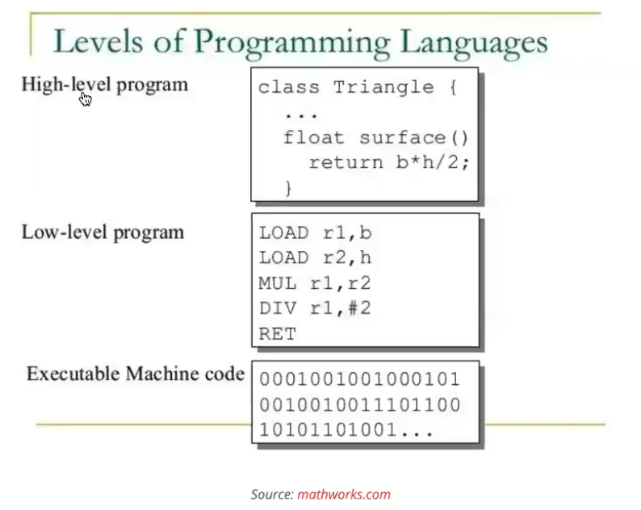
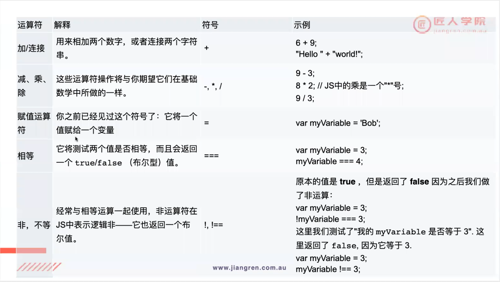
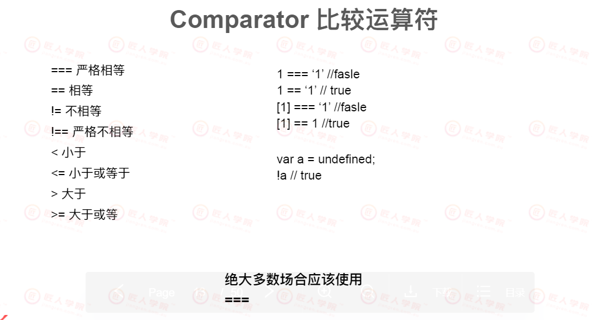
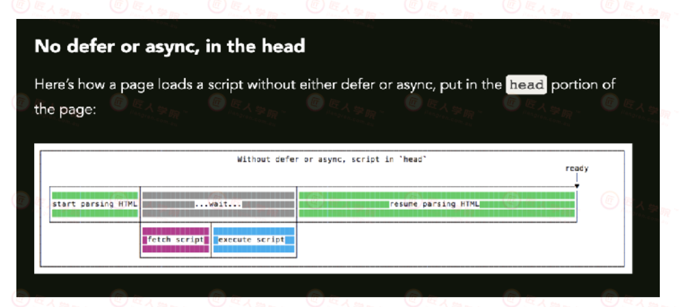
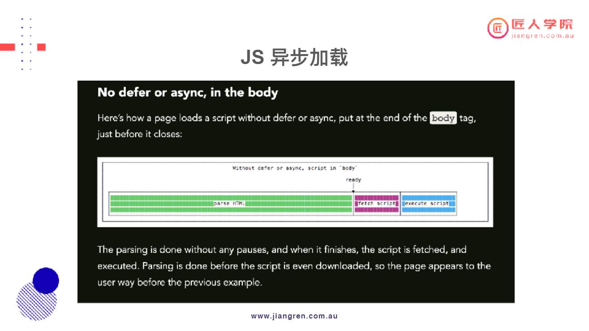
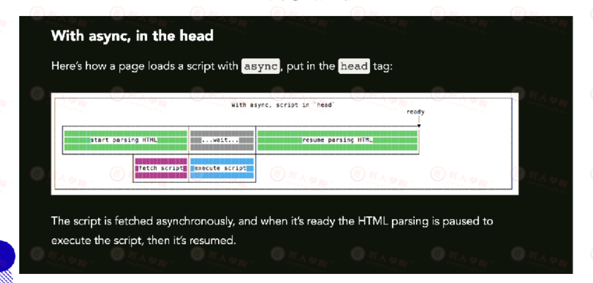
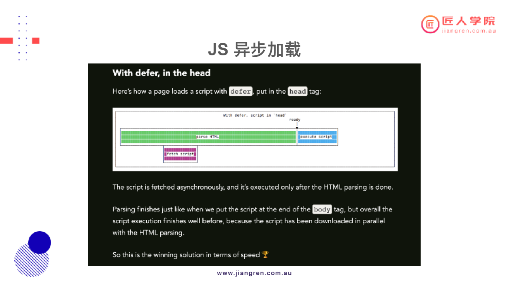

# Lecture 05 Javascript

## 主要知识点
- [Lecture 05](#lecture-05)
  - [主要知识点](#主要知识点)
- [课堂笔记](#课堂笔记)
    - [Lecture 05 JavaScript](#lecture-05-javascript)
      - [5.1 HTML+CSS+JS](#51-htmlcssjs)
      - [5.2 What is JavaScript](#52-what-is-javascript)
      - [5.3 High-level program and Low-level program](#53-high-level-program-and-low-level-program)
      - [5.4 Variable](#54-variable)
        - [5.4.1 Hoisting (面试会考，但工作中很少用到)](#541-hoisting-面试会考但工作中很少用到)
        - [5.4.2 Naming convention](#542-naming-convention)
        - [5.4.3 Data type](#543-data-type)
        - [5.4.4 Operators](#544-operators)
      - [5.5 Comparator 比较运算符](#55-comparator-比较运算符)
      - [5.6 Array 数组](#56-array-数组)
      - [5.7 条件判断语句](#57-条件判断语句)
      - [5.8 Falsey value](#58-falsey-value)
      - [5.9 循环语句Loop](#59-循环语句loop)
      - [5.10 Function函数](#510-function函数)
      - [5.11 Object对象](#511-object对象)
      - [5.12 DOM](#512-dom)
      - [5.13 JS异步加载](#513-js异步加载)

# 课堂笔记

### Lecture 05
#### 5.1 HTML+CSS+JS
- HTML: Content Structure
- CSS: Content Presentation (Layout and Design)
- JS: Content Behavior
    -  Interaction with user, User Behavior tracking, post and get data(aka AJAK)
#### 5.2 What is JavaScript
- 历史知识点： JavaScript 和 Java 是没有关系的，但JS为了蹭Java的热度， 所以名字中包含Java. 而Script说明了JS 是一门脚本语言，相对简单。
- JS is a dynamic, weakly typed programming language.
  - Weakly typed: 弱类语言 （变量的类， 函数返回的类）。
  - 不需要给变量明确定义一个类，JS依然可以运行。（JS会结合上下文，来猜是什么类）
  - 优点：很容易书写
  - 缺点：不容易维护， 不容易debug, 报错不清晰
- JS is one of the three core technologies of web development.
  - Client-side: Browser - 框架 Vue, React, Angular JS。 澳洲常用 React, Angular(排名分先后)。
  - Server-side : Node.js - Netflix
- 2015年是一个分水岭， 之前是ES5，之后是ES6。
- Chrome-> Inspect -> Console -> ```console.log("Hello world !")```
  - 方便调试
#### 5.3 High-level program and Low-level program

- 从上到下，可读性越来越差。
- JS会经过编译，形成2进制代码。编译器会帮助JS到2进制
#### 5.4 Variable 
- Variables 是存储数据的容器。 要声明一个变量需要用关键字Var
```js
    var myVariable; //declaration 定义
    myVariable = 'jiangren' //assignment 赋值
    
    var myVariable2 = 'jiangren2'//可以写为一行

    myVariable; //可以通过变量名称读取变量

    //在给变量赋值后，可以改变变量值ׁ👇
    var myVariable = 'Billy';
    myVariable = 'Lightman';

    //JS 是一种动态类型（Dynamic Type）语言👇
    var a = 0;
    a = 'String';
    a = false;
```
#### 5.4.1 Hoisting (面试会考，但工作中很少用到)
 - JavaScript引擎的⼯作⽅式是，先解析代码，获取所有被声明的变量，然后再⼀⾏⼀⾏ 地运⾏。这造成的结果，就是所有的变量的声明语句，都会被提升到代码的头部，这就 叫做变量提升（hoisting)
    ```js
        //不会报错👇
        console.log(myVariable); //print out undefined
        var myVariable //hoisting only hoist variable declarations(not assignments)
        myVariable = "JR" 
    ```
#### 5.4.2 Naming convention
- Cases:
  - UPPERCASE, **camelCase**, PascalCase, under_score, hy-phen
    - 推荐使用: camelCase
- Starting character:
  - no number, no symbol(except for _ and $)
- Reserved words:
  - if, else, instanceof, true, switch ...more
#### 5.4.3 Data type
- 数值（number）：整数和⼩数（⽐如1, 3.14 , NaN, infinity ）

- 字符串（string）：字符组成的⽂本（⽐如”jiangren” - “” ‘’没有区别，但要查看已有项目使用习惯

- 布尔值（boolean）：true（真）和false（假）两个特定值 

- undefined：表示“未定义”或不存在，即由于⽬前没有定义，所以此处暂时没有任何值(no declaration ans no value) 

- null：表示⽆值，即此处的值就是“⽆”的状态(var is declared but no meaningful value is assigned to it yet)

e.g. 检查一个变量是不是存在：
```js
// check if string value is missing
if(name!== undefined && name !== null && name !== ' ')
```
>以上所有都属于primitive value
>工作中70%的情况使用typescript
- 对象（object）：各种值组成的集合 
- 数组(Array) : ⼀种允许你存储多个值在⼀个引⽤⾥的结构。
  - index always starts from 0. ```array.length = lastIndex + 1``` 
  - 就算array length没有那么多位，依然可以在第X位给array赋值，这样array的size就等于X+1，且一旦延长了array size，it cannt be reversed
#### 5.4.4 Operators

```+```
```js
// + operator
var greeting = 'Hello!';
var name = 'I am Jing';
console.log(greeting + name) // Hello! I am Jing

var aNum = 8;
var anotherNum = 9;
console.log(aNum+anotherNum)// 17
```
```%```
```js
// %
console.log(7%3) // 1
```
```=```
```js
// ==: compare the values not the type
// ===: compare the values and the type
var aNum = 10;
var anotherNum = '10'
console.log(aNum == anotherNum); // true
console.log(aNum === anotherNum); // false
```
> 在项目中不要使用```==``` 🚫。 推荐使用```====```👌。 如果要跨类比较，请先转换变量到相同的类型后再比较。

```！```

```js
// !=: compare the values not the type
// !==: compare the values and the type
```

> 小练习：
> ```js
> 4 + 3 + "3" -> 73  // -> 7 + "3" -> "7" + "3" -> "73"
>"4" + 3 + 3 -> 433 // -> "4" + 3 -> "4" + "3" -> "43" + 3 -> "43" + "3" -> "433"
> 0.1 + 0.2 -> 0.3000000...4 //Because JS cannot present 0.1 and 0.2 precisely JS: binary. 32-bit floating point representation => precision loss
> 1+null -> 1 //null -> 0 -> 1 + 0 -> 1
> 1+undefined -> NaN // undefined ->NaN ->NaN
>```
- [Why 0.1 + 0.2 == 0.3 is false in JS](https://gauravkk22.medium.com/why-0-1-0-2-0-3-is-false-in-js-mystery-unsolved-with-solution-4f7db2755f18)

#### 5.5 Comparator 比较运算符


#### 5.6 Array 数组
```js
var a = [
	[1,3],
	[7,9]
];
console.log(a[0]); -> [1,3]
console.log(a[1][1]); -> 9

var a = [
	[1,3],
	[7,9],
	{
		name:'Jing',
		age:30
	}
];
console.log(a[2]) -> {name:'Jing',age:30}
console.log(a[2].age) -> 30

//Array.push() 尾部添加
a.push({
	name:'Jing'，
	age:30
})
//Array.pop() 尾部删除
console.log(a.length) -> 3
a.pop();
console.log(a.length) -> 2
//Array.unshift() 头部添加
//Array.shift() 头部删除
```
#### 5.7 条件判断语句
- 条件语句提供一种语法构造，只有满足某个条件，才会执行相应的语句
```js
var a = 0;
if(a===0) {
	a = a + 100;
}else{
	a = a - 100;
}

console.log(a) -> 100
```
- 三元运算符: （condition）？expr 1 ：expr 2 
```js
a === 0 ? a=a+100 : a=a-100 ; //与上方的if else语句执行功能一样
```

#### 5.8 Falsey value
```js
if(!false){
	console.log('here') --> here
}
if(!NaN){ // NaN -> false
	console.log('here') --> here
}
if(!undefined){ // Undefined -> false
	console.log('here') --> here
}
if(!null){ //null -> false
	console.log('here') --> here
}
if(!""){ //"" -> false
	console.log('here') --> here
}
if(!0){ // "" -> false
	console.log('here') --> here
}
//"0"
if(!"0"){ //"0" is not an empty string
	console.log('here') --> no print
}
```
#### 5.9 循环语句Loop
- for语句是循环命令的另一种形式，可以指定循环的起点、终点和终止条件。
- 格式如下
```js
for(initialize;test;increment){
	statement
}
```
- 从0开始，到99
```js
for（var i=0；i<100;i++）{ //i=i+1
	console.log(i);
}
//i++,++i
var i = 42; 
console.log(i++); -> 42 i++会为i加上1，但不是立即给i加上，返回的还是旧i的值
console.log(i);-> 43

var i = 42; ->42
console.log(++i); -> 43
console.log(i);-> 43
```
>++i与i++ 在for循环中没有区别

- Nested loop
```js
for（var i=0；i<10;i++）{ //一共print了100次，外面的循环走10次
	for(var j = 0; j < 100;j++){ //
		console.log(i);
		console.log(j);
	}
}
-while语句包括一个循环条件和一段代码块，只要条件为真，就不断循环执行代码块
```js
while (expression){
	statement;
}

var counter = 0;
while (counter<10){
	console.log(counter);
	counter ++;
}
```
- break 语句和continue语句都具有跳转作用，可以让代码不按既有的顺序执行。 break 语句用于跳出代码块或循环
```js
 var i = 0;
 
 while(i<20){
 	console.log('Now is: '+i);
 	i++;
 	if(i===10)break; //到10离开这个block，console output会一直打到9为止
 }
 
 while(i<20){
    i++;
  	if(i === 10) { //continue 语句要写在上面
  	continue;							
  }										
 	console.log('Now is: '+i);
 	
 }     ................       // if continue语句会终止到此为止的所有循环
 
 //以下是含有bug的一段代码， will stuck in the loop forever!!
  while(i<20){  
  	if(i === 10) { //continue 语句要写在上面
  	continue;							
  }										
 	console.log('Now is: '+i);
 	i++； 
 }    
```
 - !注意：break 和 continue 都是跳出当前的这一个循环


 >quiz:
 >在 0 到 100 之间，找出前十个，是4的倍数但不是5倍数的数字(可尝试使用·break和continue)

 Answer:
```js

 var numList = []
 for ( var i = 0 ;i<=100;i++){
 	if(numList.length === 10){
 		console.log(numList);
 		break;
 	}
 	if ( i % 4 === 0 && i % 5 ！== 0){
 			numList.push(i);
 	}
}
```

#### 5.10 Function函数
- function命令声明的代码区块，就是一个函数。function命令后面是函数名，函数名后面是一对圆括号，里面是传入函数的参数。函数体放在大括号里。
- 函数很重要，有了函数就可以复用代码
- 函数体内部的return语句，就直接返回return后面的那个表达式的值，后面即使还有语句，也不会得到执行。也就是说，return语句后面所带的那个表达式，就是函数的返回值
- ***return 和 break的作用部分重叠，但break是跳出当前的这一个循环，而return则是跳出整个循环
```js
function print(parameter){
	console.log(paramater);
}

print('String text')// String text

function greeting(str){
	console.log(str + ',I am Jing');
}
console.log(greeting('Hello!')) --> Hello!, I am Jing

function greeting(str){
	return str + ',I am Jing';
}
console.log(greeting('Hello!')) --> Hello!, I am Jing

//return
function isEven(num){
	if(num%2 == 0){
		return true
	}
	return false;
}

//quiz 2
//if no result -> []
// if res.length < 10 -> return res
// if res.length === 10 ->return res
function call(array) {
	var res = [];
	if(!array || array.length.===0){
		return []; 
	}
	
	for (var index = 0; index <array.length;index++){
		if(res.length === 10 ){
			return res;
		}
		if(array[index] % 4 == 0 || array[index] % 5 !== 0){
			res.push(array[index]);
		}
	}
	return res;
}
```
- 作用域（scope）指的是变量存在的范围。Javascript只有两种作用域：一种是全局作用域，变量在整个程序中一直存在，所有地方都可以读取；另一种、是函数作用域，变量值在函数内部存在。
- 在函数外部申明的变量就是全局变量（global varaible），它可以在函数内部读取
- 在函数内部定义的变量，外部无法读取，称为“局部变量”（local variable）
- 内部变量提升与全局作用域一样，函数作用域内部也会产生“变量提升”现象。var命令声明的变量，不管在什么位置，变量声明都会被提升到函数体的头部
```js
var globalVar = "I am Global variable";

function f(){
	var localVar = "I am local variable";
	console.log(globalVar) //Ok
}
console.log(localVar) //ReferenceError: localVar is not defined
```
- 函数参数如果是原始类型的值（数值、字符串、布尔值），传递方式是传值传递（passes by value）。这意味着，在函数体内修改参数值，不会影响到函数外部。
```js
var a = 100;

function square(num){
	num = num * num; // num is 10000
}

square(a) // a is 100
```
- 如果函数参数是复合类型的值（数组、对象、其他函数），传递方式是传址传递（pass by reference）。也就是说，传入函数的原始值的地址，因此在函数内部修改参数，将会影响到原始值。
```js
var a = {key:100};

function squareFuc(args){
	args.key = args.key*args.key;
}

squreFuc(a)
console.log(args.key);//10000

//example
var aPrimitive = 10 ;

function square（num) {
	return num*num;
}

console.log(square(aPrimitive)) ->100
console.log(aPrimitive) -> 10

var person={
	name:'Jing',
	age:30
};

function changeAge(aPerson) { //takes the address of the obj var
	aPerson.age = aPerson.age + 10;
	return aPerson;
}
//因为调用的是直接的地址，所以changeAge是直接在地址上进行修改的
console.log(changeAge(person));// person={ name:'Jing',age:40}
console.log(person);// person={ name:'Jing',age:40}
```
#### 5.11 Object对象
- 对象（object）是JavaScript的核心概念，也是最重要的数据类型。JavaScript的所有数据都可以被视为对象。
- 所谓对象，就是一种无序的数据集合，由若干个“键值对”（key-value）构成。
```js
//用一个for循环去遍历对象
person={
	name:'Jing',
	age:30
}

for (var prop in person) {
	console.log('key: ', prop);
	console.log('value: ',person[prop]);
}
-->print 结果
key:name
value:Jing
kay:age
value:30
```
>quiz:
>在一个升序,无重复数的数组中，给定一个目标值，找出哪两个数的和为这个目标值(任意一个组合），并返回这两个数的序号（index）要求：写一个function， 输入为一个数组和一个数字，输出为⻓度为2的数组
>比如：Array = [1,3,4,6,7,8,10,14,15]Target = 14 [2,6] or [3,5]

Answer:
```js
functiom twoSum(array,target){
	if(!array || array.length < 2) {
		return [];
	}
	
	for (var index = 0; index < array.length; index++){
		var match = array.indexOf(target - array[index]);
		if (match !==-1 && match !== index){
			return[index,match];
		}
	}
	return [];
}
```
#### 5.12 DOM
- DOM是JavaScript操作网⻚的接口，全称为“文档对象模型”（DocumentObject Model）。它的作用是将网⻚转为一个JavaScript对象，从而可以用脚本进行各种操作（比如增删内容）。
浏览器会根据DOM模型，将结构化文档（比如HTML和XML）解析成一系列的节点，再由这些节点组成一个树状结构（DOM Tree）。所有的节点和最终的树状结构，都有规范的对外接口。所以，DOM可以理解成网⻚的编程接口
!(DOM)[./img/图20.PNG]
- Common JS methods for DOM Manipulation
	- 1. querySelector：return the first element found or null
	- 2. querySelectorAll：return all elements as NodeList object, or empty object
	- 3. addEventListener：assign function to certain event
	- 4. removeEventListener
	- 5. createElement：create a new HTML element using the name of HTML tag
	- 6. appendChild：add an element as the last child to the element that is invoking this method
	- 7. removeChild
	- 8. insertBefore：add an element before a child element
	- 9. setAttribute：add a new attribute to an HTML element

```js
var plusButton = document.querySelector('#control-plus');
var minusButton = document.querySelector('#control-minus');
var resetButton = document.querySelector('#control-reset');
var restParagraph = document.querySelector('#control-num');

var counter = 0;

// function clickListenerHandler(elementToUpdate,opration){

    
pluusButton.addEventListener('click',function(){
    counter++;
    restParagraph.innerHTML = counter;
})
```
#### 5.13 JS异步加载
- 通常情况下，我们会把script tag放在head里。考虑这种情况，如果某一个script文件需要花费很久时间下载，执行。我们的⻚面会是什么情况。





#### 课后作业

- 完成计算器js代码
