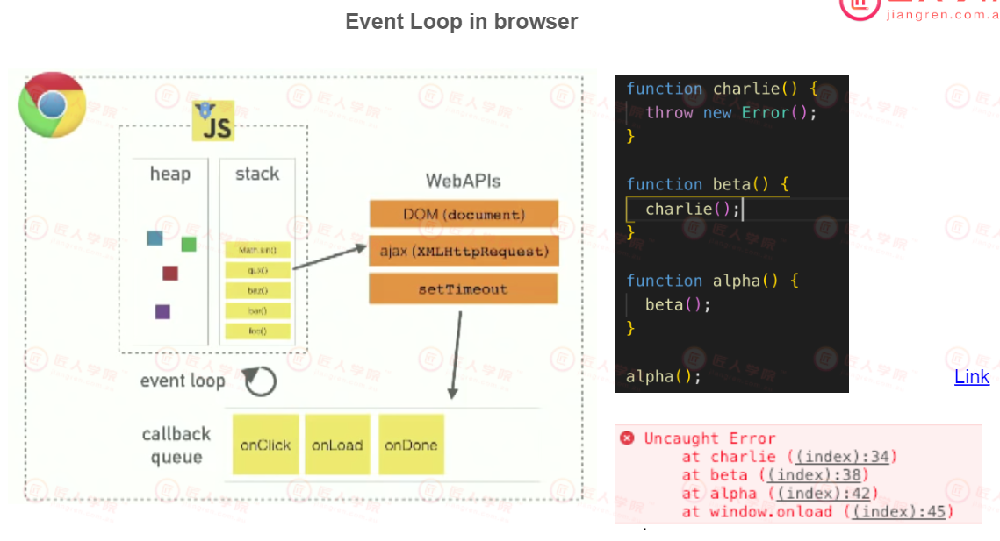
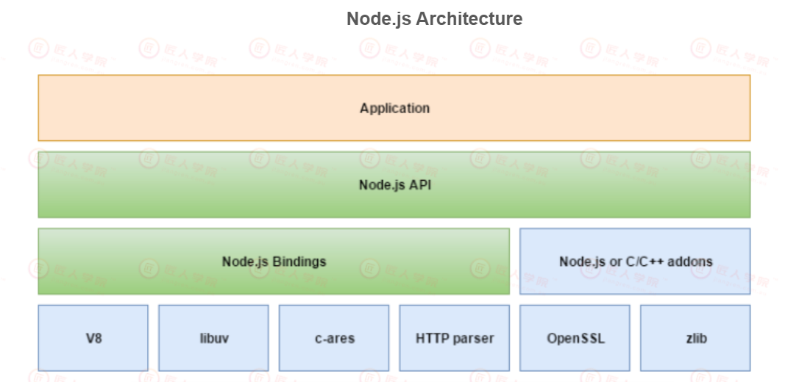

# Lecture 08 ES6&NodeJS

## 主要知识点
- [Class-08-ES6&NodeJS](#class-08-es6nodejs)
  - [主要知识点](#主要知识点)
    - [课堂笔记 JavaScript ES6](#课堂笔记-javascript-es6)
    - [8.1 Common array operations](#81-common-array-operations)
      - [Manipulation](#manipulation)
      - [Iteration](#iteration)
      - [Map](#map)
      - [Reduce](#reduce)
      - [Search](#search)
    - [8.2 Set](#82-set)	 
    - [8.3 Classes](#83-classes)
      - [What does `new` do?](#what-does-new-do)
      - [extends](#extends)
      - [prototype chain](#prototype-chain)
  - [课堂笔记 Node.js](#课堂笔记-nodejs)
    - [About Nodejs](#about-nodejs)
    - [Event Loop事件循环](#event-loop事件循环)
    - [宏任务，微任务 （简单理解）](#宏任务微任务-简单理解)
    - [建议](#建议)
    - [coding](#coding)
  
## 课堂笔记 JavaScript ES6

## 8.1 Common array operations

### Manipulation

```js
const fruits = ['apple'];

fruits.push('pear');//push 尾部添加
console.log(fruits); // ["apple", "pear"]
fruits.unshift('grape');//unshift 头部删除
console.log(fruits); // ["grape", "apple", "pear"]
// splice(x,y,newAdded)
// remove y items from index x, and add newAdded
fruits.splice(1, 1, 'watermelon', 'peach');
console.log(fruits); // ["grape", "watermelon", "peach", "pear"]
let fruit = fruits.pop();
console.log(fruit); // pear
console.log(fruits); //  ["grape", "watermelon", "peach"]
fruit = fruits.shift();
console.log(fruit); // grape
console.log(fruits); // ["watermelon", "peach"]
```

### Iteration

#### for loop

```js
const fruits = ['apple', 'pear'];
for (let index = 0; index < fruits.length; index++) {
  const fruit = fruits[index];
  console.log(fruit);
}
// apple
// pear
```

#### for...of

```js
const fruits = ['apple', 'pear'];
for (let fruit of fruits) {
  console.log(fruit);
}
// apple
// pear

// for...in -> 0, 1    usually used in object
```

#### forEach

```js
const fruits = ['apple', 'pear'];
fruits.forEach((fruit) => console.log(fruit));
// apple
// pear
// cannot use break here forEach一定会把每一项都取出来遍历一遍
```

### Map
- 映射，在保证原始数组和新数组长度一致的情况下，用于把原始数组映射到新数组
```js
const fruits = ['apple', 'pear'];
const newFruits = fruits.map((fruit) => ({
  name: fruit,
  price: 10,
}));
console.log(newFruits);
// [{name: "apple", price: 10},{name: "pear", price: 10}]
```

### Reduce

```js
const numbers = [1, 2, 3];
const sum = numbers.reduce((accumulator, number) => accumulator + number, 0);
console.log(sum); // 6
```

### Search

```js
const numbers = [1, 2, 3, 4, 5];
console.log(numbers.includes(2)); // true
// Array.some
console.log(numbers.indexOf(2)); // 1
// Array.findIndex
```

```js
const numbers = [1, 2, 3, 4, 5];
const odds = numbers.filter((i) => i % 2);//filter会把整个数组遍历一遍，找到所有符合要求的元素
console.log(odds); // [1,3,5]

const fruits = [
  {
    name: 'apple',
    color: 'red',
  },
  {
    name: 'pear',
    color: 'green',
  },
  {
    name: 'grape',
    color: 'green',
  },
];
const filteredFruits = fruits.filter((i) => i.color === 'green');
console.log(filteredFruits);
// [{name: "pear", color: "green"}, {name: "grape", color: "green"}]
```

```js
//在 ES5 中，要在数组中查找元素，可以使用 indexOf() 或 lastIndexOf() 方法。但是，这些方法非常有限，因为它们只返回第一个匹配元素的索引。

//ES6 引入了一个名为 find() 的新方法，添加到 Array.prototype 对象中。
//find会返回第一个匹配元素的元素本省
const fruits = [
  {
    name: 'apple',
    color: 'red',
  },
  {
    name: 'pear',
    color: 'green',
  },
  {
    name: 'grape',
    color: 'green',
  },
];
const greenFruit = fruits.find((i) => i.color === 'green');//查看返回的值是否为True
console.log(greenFruit);
// {name: "pear", color: "green"}
```

#### Extra reading source

[link](https://dmitripavlutin.com/operations-on-arrays-javascript/)

## 8.2 Set

Set is a data structure, we use it to store _unique_ values.

```js
const set = new Set([1, 2, 3, 4, 4]);
console.log(set); // Set(4) {1, 2, 3, 4}
set.add(5);
console.log(set); // Set(5) {1, 2, 3, 4, 5}
set.add(1);
console.log(set); // Set(5) {1, 2, 3, 4, 5}
console.log(set.has(5)); // true
set.delete(1);
console.log(set.has(1)); // false
console.log(set.size); // 4
```

```js
//对array进行去重
const array = [1, 2, 2, 3, 4, 4];
const uniqueArray = [...new Set(array)];
console.log(uniqueArray); // [1, 2, 3, 4]
//注意如果array中有object，且写的形式如下
const set = new Set()
const a = {a:1}
const b = {a:1}
// Set 不会对[a,b]去重，因为两个object的reference不一样
//注意object里不能出现重复的属性，如果出现的话，后面的value会把前面的覆盖掉
```

## 8.3 Classes
- ES6新引入的属性，可以把其代码写成类似java里的class，但其本质还是function
- 在javascript里，inheritance继承是基于原型Prototype
Classes are a template for creating objects. Classes are in fact functions, class is only a syntax sugar（语法糖).

```js
function Person(name) {
  this.name = name;
  this.toString = function () {
    console.log('name: ' + this.name);
  };
}
var mason = new Person('mason');
mason.toString(); // name: mason

//if coded like this:
var mason = Person('mason');//就是调用一个普通函数
object === undefined // True 原函数没有声明return的话，默认return:undefined；
```
#### What does `new` do?
- 实际上是创建了某种关联

```js
var mason = Person('mason');
console.log(mason.name); // ??
```

```js
function Person(name) {
  var person = {};
  // var person = Object.create(Person.prototype);
  person.name = name;
  return person;
}
Person.prototype = Object.create(Object.prototype);
// Person.prototype.__proto__ === Object.prototype
Person.prototype.constructor = Person;

var mason = Person('mason');
console.log(mason.name); // mason
```

```js
//换了一个名字的function，但是class会自动绑定相应的原型，不再需要bind()
class Person {
  constructor(name) {
    this.name = name;
  }
  toString() {
    console.log(`name: ${this.name}`);
  }
}
const mason = new Person('mason');
mason.toString(); // name: mason
```

### extends

```js
class Teacher extends Person {
  constructor(name) {
    super(name);
  }
  teach() {
    console.log(`${this.name} is teaching`);
  }
}

const mason = new Teacher('mason');
mason.teach(); // mason is teaching
mason.toString(); // name: mason -> BUT how?
//子类继承父类后，可以使用父类的constructor()和methods

//if code like this:
function Person(name) {
  this.name = name;
  this.toString = function () {
    console.log('name: ' + this.name);
  };
  return 1;
}
const mason = new Person("")
mason // Person{name:'',toString:f} 会把原本的return:1；覆盖掉

//if code like this：
function Person(name) {
  this.name = name;
  this.toString = function () {
    console.log('name: ' + this.name);
  };
  return {a:1};
}
const mason = new Person("")
mason //{a：1} 不会被替换掉
```

```js
// is mason constructed by Teacher?
mason instanceof Teacher; // true
mason instanceof Person; // true
mason instanceof Object; // true
```
#### prototype chain

```js
Teacher.prototype.__proto__ === Person.prototype; // true
Person.prototype.__proto__ === Object.prototype; // true
Object.prototype.__proto__ === null; // true
```
## quiz

```js
function Pet(name) {
  this.name = name;
  this.getName = () => this.name;
}

const cat = new Pet('Fluffy');

console.log(cat.getName()); // Fluffy

const { getName } = cat;
console.log(getName()); // Fluffy
```

```js
var scope = 'global scope';
function checkscope() {
  var scope = 'local scope';
  function f() {
    return scope;
  }
  return f();//返回function执行的结果
}
checkscope(); // local
```

```js
var scope = 'global scope';
function checkscope() {
  var scope = 'local scope';
  function f() {
    return scope;
  }
  return f;
}
checkscope()(); // local
```

Quiz questions references
[1](https://dmitripavlutin.com/javascript-this-interview-questions/#question-1-variable-vs-property)


## 课堂笔记 Node.js

### About Nodejs
- 优势：灵活，可以用JavaScript打通前后端

- 前端的文件属于static assets，决定网页会显示什么内容，但内容里的信息是从后端服务器取回的
- 流程：用户请求页面----页面框架被下载下来----发相应的API请求来获取相应的数据------数据返回到前端页面----javascript把返回的数据与页面进行拼接---最终显示成实际开发的页面的样子
>Q：请求第三方API时，第三方API的token是从前端还是后端获取？
>A：为了安全性考虑，一般会把token存在后端, 但平常会按照第三方平台给出的示例代码来做


- 异步 Async 事件驱动
    + JavaScript是单线程，因此同时只能做一件事，如网页代码中包含需要加载很长时间的图片，后面的代码会被阻塞住，无法执行
    ```js
    console.log(1)
    console.log(2)
    console.log(3)
    //会从上往下执行，打印顺序为1，2，3
    ```
    + 所以要使用异步
    ```js
    console.log(1)
    setTimeout(() => {
    console.log(2)
    })
    console.log(3)
    //打印顺序为1,3,2,先执行事件的注册，并发出相应的请求，继续从上往下执行同步代码，等未来的某个事件发生后，再继续回来执行该注册好的代码
    //同步 = 等待 = 阻塞（BLOCK)
    //异步 = 不等待 = 非阻塞（NON-BLOCKING)
    ```
    + `callback()`在一个event完成后进行
    + `callback()`可以进行嵌套，来表示逻辑的执行顺序，但会导致callback hell的问题，代码可读性变差
    + 因此会使用`Promise`
        - 有三种状态 pending fulfilled(resolved) rejected
        - 状态变化 pending -> fulfilled, pending -> rejected
        - `.then` 获取resolved的结果, `.catch`获取rejected的信息, `.finally` 无论resolved还是rejected都会执行
- Nodejs只是一个JavaScript的基于Chrome V8引擎的runtime环境
- non-blocking I/O 
    + 非阻塞 == 异步 == 不等待异步执行的代码，充分利用资源
    + I/O Input Output

### Event Loop事件循环

- heap储存数据
- stack执行代码，又名callstack，先进后出
>小知识：stackoverflow，当前调用栈溢出
- 在JS执行时首先会从上向下执行，异步代码会由web api注册由浏览器单独管理，同步代码会继续执行
- 被放到callback queue中挨个放入stack中执行
- 流程
  - 同步代码执行碰到异步代码丢给web api注册
  - 时间结束 -> 事件进入callback queue
  - 当call stack为空的时候
  - event loop会从callback queue取前列的event，继续执行

- 事件循环的视频例子 [http://latentflip.com/loupe/?code=JC5vbignYnV0dG9uJywgJ2NsaWNrJywgZnVuY3Rpb24gb25DbGljaygpIHsKICAgIHNldFRpbWVvdXQoZnVuY3Rpb24gdGltZXIoKSB7CiAgICAgICAgY29uc29sZS5sb2coJ1lvdSBjbGlja2VkIHRoZSBidXR0b24hJyk7ICAgIAogICAgfSwgMjAwMCk7Cn0pOwoKY29uc29sZS5sb2coIkhpISIpOwoKc2V0VGltZW91dChmdW5jdGlvbiB0aW1lb3V0KCkgewogICAgY29uc29sZS5sb2coIkNsaWNrIHRoZSBidXR0b24hIik7Cn0sIDUwMDApOwoKY29uc29sZS5sb2coIldlbGNvbWUgdG8gbG91cGUuIik7!!!PGJ1dHRvbj5DbGljayBtZSE8L2J1dHRvbj4%3D]



### 宏任务，微任务 （简单理解）
- 宏任务 -> setTimeout, ajax call, DOM events
- 微任务 -> promise

### 建议
- 能用箭头函数尽量用箭头函数
- `command+shift+p`打出分割线
- Visual Studio Code 由electron
  
### coding

#### module example
```js
in index.js

//REPL(read evaluate process loop)

//Here is an IIFES
const moduleA = {exports:{}}
const moduleB = {exports:{}}
(function(module){
  const msg = "secret msg";
  
  function getMsg(){
  	return msg;
  }
  
  module.exports = {getMsg}
})(moduleA);

(function(module){
  const msg = "another msg";
  
  function getMsg(){
  	return msg;
  }
  
  module.exports = {getMsg}
})(moduleB);

moduleA.exports.getMsg();
moduleB.exports.getMsg();


//object 简写
{
  getMsg: getMsg
}
//当key与value相同时，可以简写成：
{
  getMsg
}

//How to rewrite the above code with Node.JS?
//NodeJS包含了自动模块化内置
in messageA.js：
const msg = "secret msg";
  
  function getMsg(){
  	return msg;
  }
  
  module.exports = {getMsg}
  
in messageB.js：
const msg = "another msg";
  
  function getMsg(){
  	return msg;
  }
  
  module.exports = {getMsg}
  
in index.js
//将messageA.js文件中导出的的{getMsg:getMsg}解构赋值为{getMsg:getMsgA}
const {getMsg:getMsgA} = require('./messageA');
//将messageB.js文件中导出的的{getMsg:getMsg}解构赋值为{getMsg:getMsgB}
const {getMsg:getMsgB} = require('./messageB');
getMsgA();// secret msg
getMsgB();// another msg

//也可以写成
const getMsgA = require('./messageA');//getMsgA为一个object
getMsgA.getMsg();

//打印当前路径名
console.log(__dirname);
//打印当前文件名
console.log（__filename);
```

#### server example
[link](https://github.com/LazeBear/jr-fullstack-notes-16/tree/master/1-node.js)
