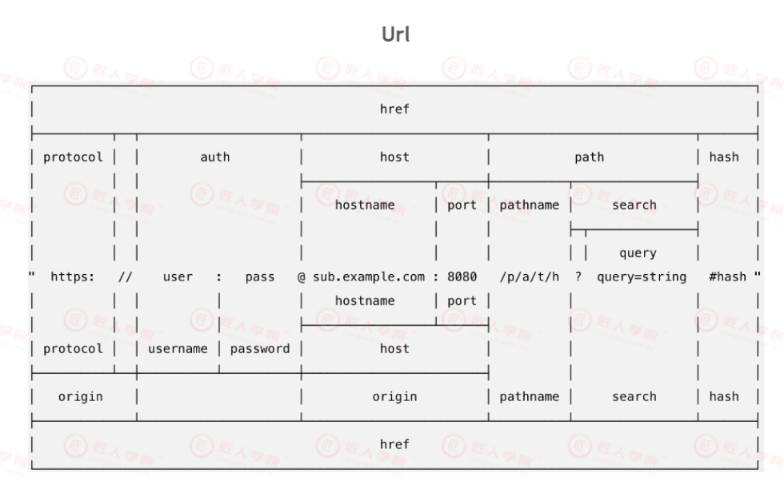
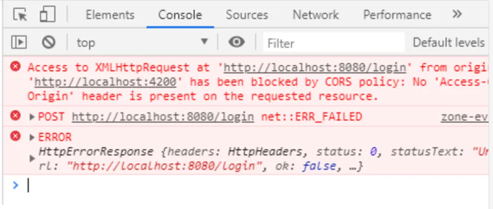
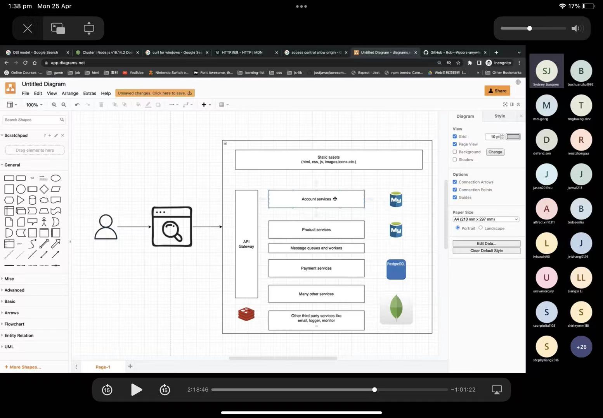

# Lecture 09 NodeJS&ResfulAPI

## 主要知识点

- [Lecture-09-NodeJS & RESTful API](#Lecture-09-nodejsrestful-api)
- [主要知识点](#主要知识点)
  - [课堂笔记 RESTful API](#课堂笔记-restful-api)
    - [9.1 Protocol协议](#91-protocol协议)
    - [9.2 URL的组成](#92-url的组成)
    - [9.3 HTTP Methods](#93-http-methods)
    - [9.4 HTTP Headers](#94-http-headers)
    - [9.5 Response (status) code](#95-response-status-code)
    - [9.6 JSON](#96-json)
    - [9.7 SOAP](#97-soap)
    - [9.8 API](#98-api)
    - [9.9 REST (Representational state transfer)](#99 rest-representational-state-transfer)
    - [9.10 RESTful API 设计规范 ](#910-restful-api-设计规范)
    - [9.11 Microservices](#911-microservices)
  - [Practise](#建议)

## 课堂笔记 RESTful API

#### 9.1 Protocol协议
- protocol协议相当于一个固定的格式，双方之间交流沟通的前提：
	- 如写信的时候要写收信人的姓名地址电话，才知道谁来收这封信 
- HTTP（HyperText Transmission Protocol）是我们最熟悉的协议：
	- 打开Chrome浏览器的地址栏，前面会有https的前缀，这个前缀就是该网站的协议，https相比http，加上了一层安全层，给数据进行加密
	- 最常用的http协议是 http1.1 和 http2，我们在开发阶段会使用http1.1的协议，https需要我们自己加一个验证来保证数据是保密的，且https是基于http2协议上的，***p3会需要我们给server买域名，到那时我们可以考虑要不要使用http2协议***
- TCP （Transmission Control Protocol）和 IP（Internet Protocol）最大的用处是：
	- IP 让我们知道请求的目标地在哪里，TCP帮助我们把请求安全有序地传递到目标位置
	- TCP 建立链接需要三次挥手，断开连接需要四次挥手：
		- [TCP 3-Way Handshake Process](https://www.geeksforgeeks.org/tcp-3-way-handshake-process/)
		- [Why TCP Connect Termination Need 4-Way-Handshake?](https://www.geeksforgeeks.org/why-tcp-connect-termination-need-4-way-handshake/?ref=rp) 
		- A：连接终止的时候需要四次挥手，因为TCP是一个全双工连接，一端发送完了数据不代表另一端没有数据要发送了，所以需要双方各自关闭一次，而连接的时候为什么只需要三次握手呢，是因为第二次握手的过程是同时包含了SYN和ACK的，因为连接的时候没有必要像断开那样分两个方向断开连接，因为连接都还没建立，双方肯定没有数据在发送

	- 了解更底层的知识可以了解什么是[OSI mode](https://www.forcepoint.com/cyber-edu/osi-model)

#### 9.2 URL的组成

- URL全称：Uniform Resource Identifier 统一资源标识符
	- Protocol协议部分：包括http、MongoDB协议，省略不写一般是https协议 
	- auth验证部分：用户尝试访问加密资源时，传入用户名和密码证明是权限用户，会用@符号和host部分隔开，现在不常用，
	- host域名部分：hostname会通过DNS域名解析转换成IP地址，写成英文是为了容易记忆，后面有时会加上port端口号，指明了会和该地址的那一个端口进行通信，又是端口可以省略不写，因为协议会有默认端口，如https为53，http为80
	- path路径部分：通过路径分析到底是哪一个资源，search部分表示对这个资源有哪一些搜索的条件或要求，search后会有一个问号 ‘’？“代表问号后面是搜索参数，query代表了搜索框里的东西，q是query的缩写，q=string
	- hash锚点部分：只在浏览器中有用，目的是让浏览器在渲染时直接跳转到当前锚点所在的位置

- Q:  现在的验证用户不用auth的方法了，那他们现在用的是什么方法呢？
- A：使用token，用户登陆时会发一个请求携带用户名和密码，这个请求发到后端会返回一个token，任何携带该token的用户都等于该用户本人，token可以进行加密

#### 9.3 HTTP Methods
- GET 一般发送请求时，取得数据
- POST 数据添加
- PUT 更新数据，数据替换
- DELETE 删除数据
- PATCH 更新部分数据 与PUT类似 按公司规定使用

#### 9.4 HTTP Headers
- 可以使用curl命令查看HTTP request， linux和MacOS可以直接使用，Windows需要安装
- Request Headers部分：
	- 第一行格式：GET / HTTP/2     METHOD PATH PROTOCOL
	- Host：www.google.com 请求的网站地址
	- User-Agent：curl/7.64.1 client通过哪个方式和浏览器访问
	- Accept: */* 接收什么样格式的数据，有时只写html、css、javascript，告诉server自己接收什么样的信息
	- 总结：Header部分是为了让client和server相互之前通信时有一个标准的格式

- [扩展阅读](https://developer.mozilla.org/zh-CN/docs/Web/HTTP/Messages)
- 常用的HTTP Headers
	- Content-Type: text/html 数据类型
	- Allow: GET, PUT, POST 允许的请求类型
	- Referer: 告诉信息收集平台，用户从哪里来的，例如Google，程序会收集headers来分析用户来源比
	- User-Agent: 用户通过哪个浏览器访问
	- Access-Control-Allow-Origin： **开发时会碰到** 以下错误 如果client发的请求返回的数据，没有‘access-control-allow-origin’ header会被浏览器拦截，属于跨域访问，使用CORS anywhere可以设定允许哪些跨域访问
	
- Authorization Header: `<Type> <credentials>`
	- Type部分：
  		- `Basic` username and password
  		- `Bearer` Oauth 2.0 protected resources through bearer token  在我们之后的开发中常用
	- 其他
  	- header的信息是可以伪造的,所以不能百分百相信.
  	- x-custom : 自定义的header, 明确告诉server这个是自定的/server要求自定义header以用作其他用途 

#### 9.5 Response (status) code
- 200 OK 表示请求发送成功
- 201 Created 表示post请求的添加操作成功了
- 204 No content 表示请求发送成功但是不返回任何内容，delete request表示删除成功会发这个
- 209 Conflicts 用户名重复
- 304 Not Modified 并不很常用
- 400 Bad Request 请求有错误 客户端有问题
- 401 Unauthorized 用户没有权限访问
- 404 Not Found 找不到数据或资源
- 500 Internal Server Error 服务端内部错误，尽量不要出现在生产环境

#### 9.6 JSON
- XML和JSON的区别：JSON语法更简单，使用key value pair，可读性更高，XML有open tag closing tag，在JSON之前使用XML格式，现在已经渐渐被JSON取代
- 序列化与反序列化：javascript 的一个object转化成一个字符串（json），字符串（json）转换成 javascript object
- Json 不支持 undefined 的 value, 所以如果当数据里有undefine的情况, 它的key会消失(或者说就不存在了)
- 以下做法会经常被使用在深拷贝上：
`console.log(JSON.stringfy(course));`
`console.log(JSON.parse(JSON.stringify(course)));`
#### 9.7 SOAP
- Simple Object Access Protocol , 这个protocal比较注重权限和安全性,在设计上会比较复杂
- 一个安全性很高的协议，银行，政府会使用
#### 9.8 API
- Application programming interface 应用程序编程接口
- 可被外部访问的接口被称为public API，或web service网络服务
- 它对一些复杂的逻辑进行了封装和解释,记录函数/组件的使用方法(可以的话尽量做到”代码即注释“)
#### 9.9 REST (Representational state transfer)
- 本身概念很难理解，作为开发者只需要理解如何使用
- 可以通过看URL大概知道该请求是做什么的，如：GET /books
- Rest可以帮助定位我们想要的资源，并且进行相应的操作
- Stateless 无状态：
	- 有两个请求A和B，A和B发送的先后顺序不同，得到的结果是一模一样的，现在的server端开发基本都是无状态
- Stateful 有状态：
	- A和B发送顺序错误会导致访问不到  
#### 9.10 Restful API 设计规范
1. versioning（版本）出现在url后面，版本号后面跟实际的资源(加上版本控制确保改动不波动到所有用户正在运营的项目P)
- 例如
	- example.com/api/v1
	- example.com/v1
	- example.com/v2/books

2. url 里，尽量使用名词noun，不要使用动词，资源尽量使用复数形式
- 例如：
	- GET /v1/books
	- GET /v1/getBooks x
3. 保证GET 不会对资源进行修改（污染）
- 例如：
	- GET /v1/books（只读数据，而不作更新或修改）

4. url 推荐使用嵌套结构
- 例如：
	- GET /posts/:postId/comments
	- GET /posts/{postId}/comments 
	- GET /posts/post123/comments 
5. 对返回的数据进行分页（注意返回的大小）
- 如果有1000个数据，取回来也不可能全部显示在页面上，用户也不大可能把数据全部看完，为了避免浪费和更长的传输时间， 因此需要对返回的数据进行分页
	- 例如：
		- GET /v1/books ->该请求永远只返回10个数据
		- GET /v1/books?page=26pageSize=100 ->给该请求加query frame 每页100个数据 
6. 使用正确的status code来表示返回的结果

7. 尽量返回人性化的文本信息（错误信息）
- 例如：
	- {”error“：”invalid password“}
	- {”error“：1001} // 不友好的 error code

#### 9.11 Microservices

-  一种服务端的设计架构
- monolith server
- 原本的每个服务会单独拆分出来(根据用户访问量等),每个service都有它自己独立的数据库和server,所有的请求由api gateway转发给不同的server
- service互相调用数据的话必须通过该对应的servcer的api接口去调用
- 嵌套结构，/library/{libId}/book
- 优点：其中任何一个service挂掉，不会影响整体的工作，如Product坏了，用户的注册不会受到任何的影响

- Q：什么是Lambda？
- A：相当于server里的一个具体的逻辑，讲其抽出来放到server上

- Q：GraphQL为什么没有取代Restful API？
- A：GraphQL学习成本更高，且有很多不支持的功能，如文件上传

#### Practise  
- Use postman to practise api calls
- https://newsapi.org/
- 开发时先用注释表示流程，有助于面试思路