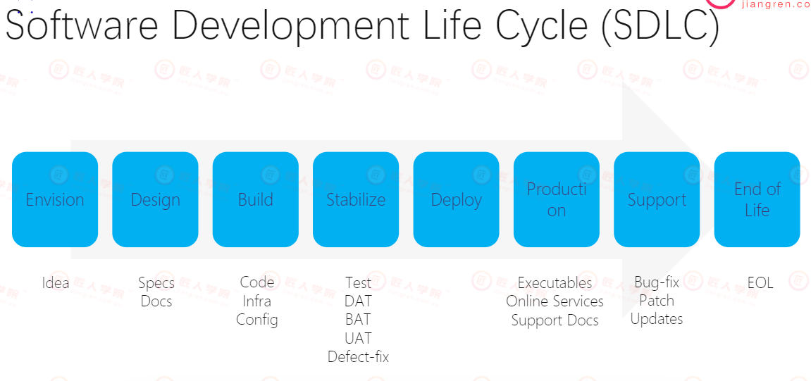
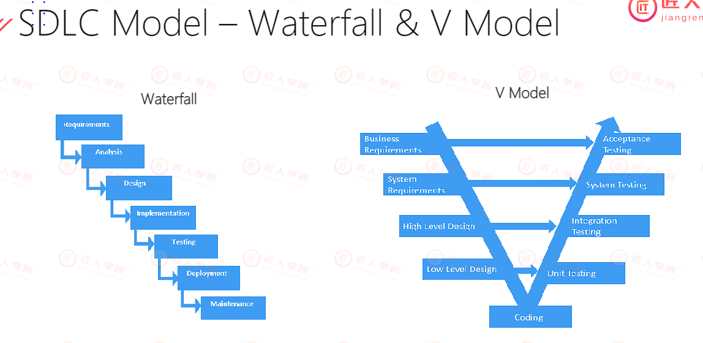
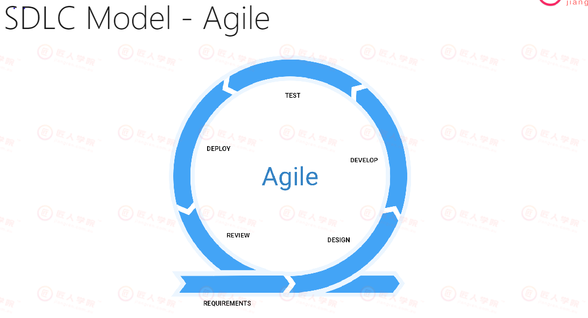
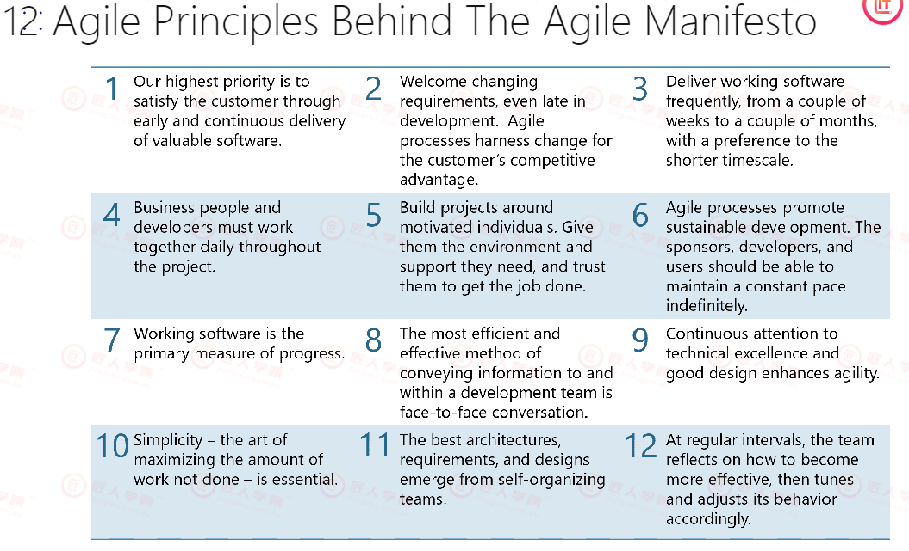
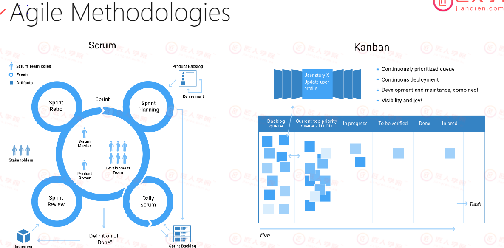
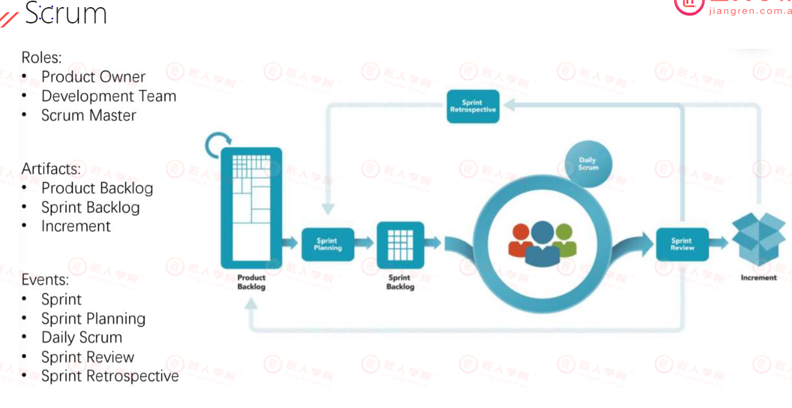
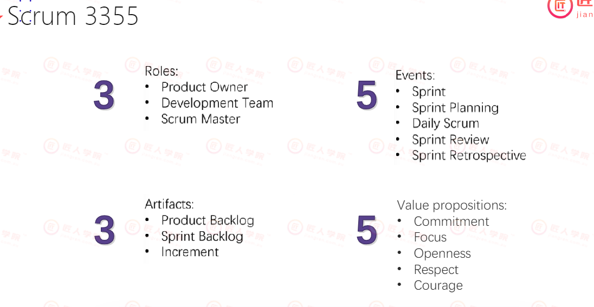

# Lecture 11 Agile&Scrum

## 主要知识点
- [Lecture 11 Agile&Scrum](#Lecture-11-agilescrum)
  - [主要知识点](#主要知识点)
  - [课堂笔记 Agile](#课堂笔记-agile)
  	- [11.1 为什么使用敏捷开发？](#111-为什么使用敏捷开发) 
    	- [11.1.1 Software Development Life Cycle (SDLC)](#1111-software-development-life-cycle-sdlc)
    	- [11.1.2  SDLC Model软件开发生命周期的两种模型](#1112-sdlc-model软件开发生命周期的两种模型)
    - [11.2 什么是敏捷开发？](#112-什么是敏捷开发)
    	- [11.2.1 Agile Values](#1121-agile-values)
    	- [11.2.2 Agile Principles](#1122-agile-principles)
    - [11.3 什么是Scrum？](#113-什么是scrum)
    - [作业](#作业)

## 课堂笔记 Agile

#### 11.1 为什么使用敏捷开发？
#### 11.1.1 Software Development Life Cycle（SDLC)
  
  - Designer 会在Design阶段提供详细的设计图，Detailed Design（API、UI、UE、color等）
  - Developer在Build阶段进行coding，Devops创建云端framework
  - Stabilize测试阶段，unit test，integration test
  - Deploy 产品上线
  - Production 产品发布
  - Support 产品维护，bug fix

#### 11.1.2 SDLC Model软件开发生命周期的两种模型
  
	- 陈旧的项目管理方式
	- Waterfall是从上至下的，无法回到上一阶段
	- V Model是Waterfall的一种改进，致力于严格项目的测试。
#### 11.2 什么是敏捷开发？
- 软件是由code组成的，需要持续创新，全球竞争激烈，用户可以无成本转移使用竞争对手的产品，因此传统由上至下的项目管理不适用于软件开发
	- 迭代式开发Iterative，沟通communication，拥抱变化changes，working results
	- 抛弃了detailed design，只需要产品能用working
	- 从上至下 —> 连接成圈  
	 
	
	 - 一个圈就是一个iteration
	 - Design > Develop > Test > Deploy > Review，在Review中做的不好的部分会在下一个iteration中继续讨论
#### 11.2.1 Agile Values

- Individaul > Tools
- Working Product > Comprehensive Documentation
- Customer Collaboration > Contract Negotiation 先与customer合作讨论
- change > plan 
#### 11.2.2 Agile Principles

  - 实际工作中，Business People 和developer需要经常面对面沟通，如每天的standup meeting
	- 要保证用最好的质量做好已经有的需求，让明天的工作更加容易
	- 没有提的需求就不要做， 让今天的工作更少一点

- Agile原则是：①减少浪费 ②快速产出 ③不断地带 ④交流沟通 ⑤响应变化

#### 11.3 什么是Scrum？

- Sprint
  - 四个步骤
    - Sprint Planning 定计划
    - Daily Scrum 讨论执行
    - Sprint Review 检查
    - Sprint Retro 回顾总结
  - 每个Sprint的周期不同，大多数情况是2或3周
  - Sprint的capacity要确认好，尽量不delay sprint
  
-  Kanban（stand-up meeting所用工具）
   -  其中包括许多backlog
   -  backlog任务认领
   -  每个人的任务速度可能不同
   -  完成任务后，相应标签往右移动一栏
   -  Business people每天安排最右边的Todo list给各位developer
   
- Scrum
  - Lightweight tool for enabling business agility 
  - Simple to understand, yet difficult to master（scrum master有相对应的证书）
  
  
  
  - Roles 团队成员
    - Scrum Master（确保流程能顺利往下走）
    - Product Owner
    - Development Team
    - Stackholder (外部)
  - Artifacts
    - Product Backlog （产品的所有需求 from user/developer/roadmap）
      - 所有的backlog
      - wish list not to-do list
      - 其中一种例子为User Story = persona + need + purpose
    - Sprint Backlog 本sprint内需要做的需求，从Product Backlog中筛选出的
    - Increment 产出
  - Event
    - Sprint
    - Sprint Planning 规划
    - Daily Scrum 每天的会议
    - Sprint Review 对本Sprint的review
    - Sprint Retrospective Sprint结尾的Retro会议
    	- 每个人来说一说：哪些做得不好，需要如何改进，哪些做得好，需要如何保持 
  > Q：Product Manager和Project Owner的区别
  A：Product Manager管理产品流程全程，Product Owner是团队的一部分，只是把产品的需求进行解释
  
- Scrum 3355
 
  
	- Scrum Retrospective Meeting
		- 会有dashboard，可以往上贴贴纸，不会强迫说出来
		- 目的是提升工作效率
		- 如果可以improve，给出具体要怎么做，不能假大空（如分配给developer更多的交流时间）  
  > Scrum Master是一个类似lLeader的角色，负责组织安排meeting，团队的老带新，把简单的任务分给junior等，确保任务完成 

- Product backlog：
	- Product Backlog Items: 
	  - Feature 
	  - Defects 要修的bug
	  - Technical Work 版本太旧或者性能不好，进行重构refactor或者update
	  - Knowledge acquition 加入ML、AI、DS 的东西，都需要学习
	- User Story - New Features
	  - User story = persona + need + purpose
	    - e.g. As a [persona], I [want to],[so that] 
	  - Acceptance Criteria: 功能做到什么程度才能被接受
	    - e.g. 打印功能需要能够打印成pdf以及可以勾选打印哪几页
	

#### 作业
- 阅读资料，回答问题
- Azure DevOps Lab Practice
1. Open https://dev.azure.com1. Login with your Microsoft Account or create a new account and login
2. Create a new organisation on your Azure DevOps
3. Configure your demo project environment (Task 1 only)https://azuredevopslabs.com/labs/azuredevops/prereq/
4. Finish Azure DevOps Lab agile task https://azuredevopslabs.com/labs/azuredevops/agile/
