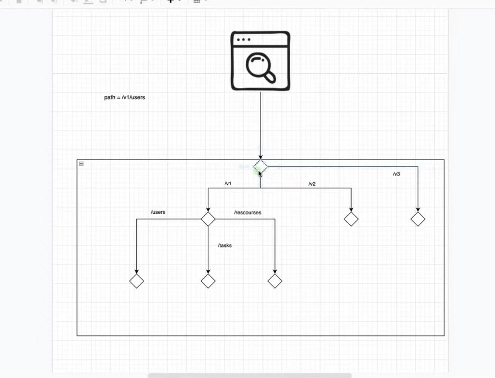
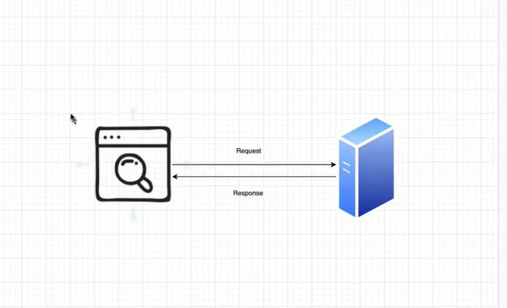
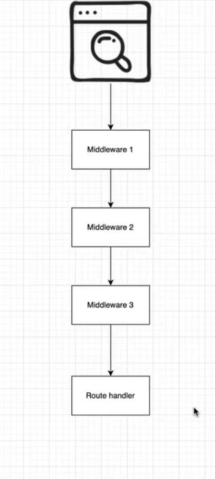
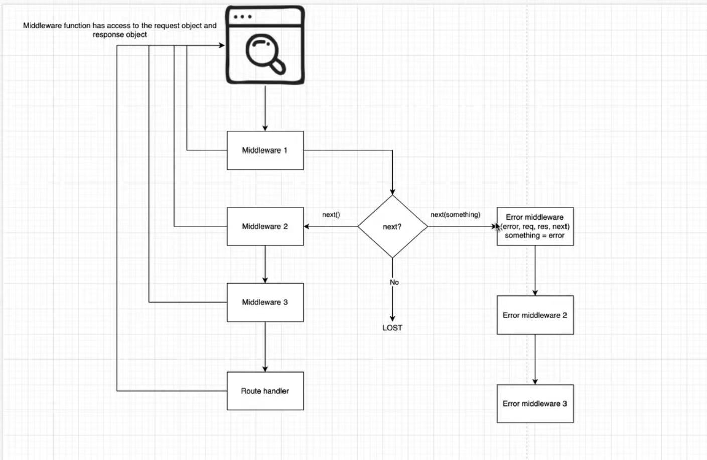
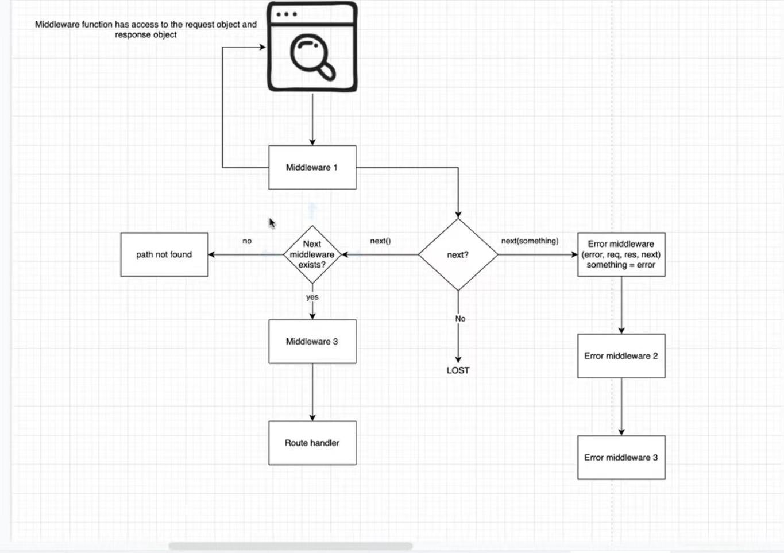

# Lecture 12 Middleware

## 主要知识点
- [Lecture 12 Middleware](#Lecture-12-middleware)


## 课堂笔记 Middleware


- 想象setTimeout 触发了一系列的函数，第一个函数执行完触发第二个，以此类推
- middleware像是一个function，被放到route handler中，在route handler代码前执行
- middleware function执行下列操作：
	- 执行代码
	- 对 request和response body做出改变
	- 结束 request-response cycle
	- call stack中的下一个middleware function
	- 注意：如果现有的middleware function没有结束request-response循环，它必须call next（）把控制权交给下一个middleware function. Otherwise，这个请求就会left hanging，永远不会返回 
  - 
  
  - 浏览器发出请求，server回复response，形成循环
  - 在分散路径前，加一系列的middleware function，在请求进来后，根据请求的路径，会触发一系列的middleware function，middleware chain的排列顺序是根据请求的路径来看的
  - 如果想要给上图中的`/users`和`/resources`加的话，是加在菱形结点之前，不是分岔口
  
  - middleware function的触发顺序是由路径决定的

 1. 如果`Middleware1`调用`next()`会跳到`Middleware2`如果什么都不调用的话请求就会消失，
 2. 如果`Middleware1`调用`next()`的时候传入了参数变成`next（something）`，会进入`Error middleware`，分析错误是什么，然后进行处理, `Error middleware`处理的是一些常见错误，如validation error，一般用户密码错误会直接放在route handler里面
- 具体例子：`Middleware1`是一个验证token的Middleware，发现错误后把错误参数传给`Error middleware`识别错误具体类型，最后一个`Error middleware`通常是为了记录下该错误，让错误尽快修复，通常返回500状态码
- `Middleware`的触发是由路径决定的，只有route到该路径才会触发，而`errorMiddleware`是固定的，只要在`next()`里传入了参数就会进入到`erroMiddleware` chain上

- 代码示例：
```js
//使用userInfo储存用户的所有信息，以便其他middleware调用
const authGuard = (req,res,next) => {
  //get token from request header
  //extract user info from token or from db
  req.user = userInfo;
  //注意，不需要在req里提供user属性，用户信息已经被express封装在里面了，user属性是新加的
  next();
}

const m1 = (req,res,next) => {
  //if token not exists{
  //res.json({error:"token not found"});
  //xxxxx can be string, can be object {type:xxx,message:xxxx},can be new Error（''）；
  //next(new Error（''）);
  //next(xxxx);(no need)
  //return;
 //}
 next();
}

//看抛出的错误是否是想要检测的错误
const errorM1 = (error,req,res,next)=>{
  if(error.type ==='validationError'){
    res.status(400).json({error:error.message});
    return; //如果符合判定条件，则返回信息，并终止
  }
  或
  if(error instanceof CustomerError) {
  }
  next{error}； //如果该error不是该errorMiddleware想要检测的错误，就把该error传给下一个errorMiddleware
}

//为了书写方便，会自定义一个error名字当作传入next（）的parameter
//next(new CustomeError(''));

//最末尾的error handler
const errorHandler = (err,req,res,next)=>{
  console.log(err)//给该error做记录,通常放在 logging lib -> log -> logging platform
  res.status(500).json({error:"please try later"});
}
class CustomError extends Error{
}
class ValidationError extends CustomError {
  constructor(){
    super();
  }
  //so validation error is an intance of CustomError and Error
}
```
- 注册Middleware：
```js
//注册application level的Middleware，匹配所有路径
app.use(express.json());
//对’/‘路径注册middleware
app.get('/',m1);
//在注册route handler的时候注册middleware
app.get('/',m1，m2，m3,m4,(req,res) => {;
//注册 errorMiddleware
app.use(errorM1);
app.use(errorM2);
app.use(errorHandler);

app.listen(3000);
```
- `app.get/post`和`app.use`的区别
	- app.get/post 只能匹配与method类型完全相同，路径完全相同的请求
	- app.use 所有以该路径开头的请求，都能匹配成功
		- 如app.use(express.json())就相当于app.use('*',express.json()),'*'等于所有路径 
- path not found 情况
	- 调用的下一个middleware function不存在 
	
- middleware小练习
```js
function m1(req,res,next){
	console.log('m1 called');
}
function m2(req,res,next){
	console.log('m1 called');
}
function m3(req,res,next){
	console.log('m1 called');
}
function m4(req,res,next){
	console.log('m1 called');
}
app.use(m1);
app.use('/v1',m2);
app.get('/v1/tasks',m3);
app.get('/v1/tasks',m4);
app.get('/v1/tasks/:id',(req,res)=>{
  res.json(req.params);
});

app.listen(300,()=> console.log('listen on 3000'));

//quiz
1. GET /v1/tasks
Answer:
listen on 3000
m1 called
m2 called
返回：{
id:1;
}
2. GET /v1/tasks
Answer:
m1 called
m2 called
m3 called
m4 called
返回：Cannot get /v1/tasks
```

> 注意：当把函数写成 const a = (req, res, next) => {
} 
必须得把app.use 写在该函数的下方才能调用

- express Router
	- 如此划分，让工作相关的区分更明确了，所有task相关的请求都有task router来负责，一个router负责管理和这个router相关的所有资源请求
```js
const router = express.Router();
//注册taskRouter
const taskRouter = express.Router();
//mini app

//把taskRouter注册到‘/’上面，指/v1/task/ 后面的东西
taskRouter.get('/',(req,res)=>{
	res.json({1,2,3})
})
//注册v1Router
cost v1Router = express.Router();
//把taskRouter注册到v1Router上面
v1Router.use('/tasks',taskRouter); //指 /v1/tasks后的东西
//把v1Router注册到application level上
app.use('/v1',v1Router); //指/v1后面的东西
```


`app.use(express.json())`能把request中的json格式的数据解析成js object，加括号的原因是，express.json是一个普通函数，他执行后返回一个middleware function，最终目的是使用app.use调用这个middleware
`app.use(express.urlencoded({extended:true}));` 能把前端提交的x-www-form-urlencoded格式表单解析出来并拆分成js object
`body-parser`是express的一个依赖项

